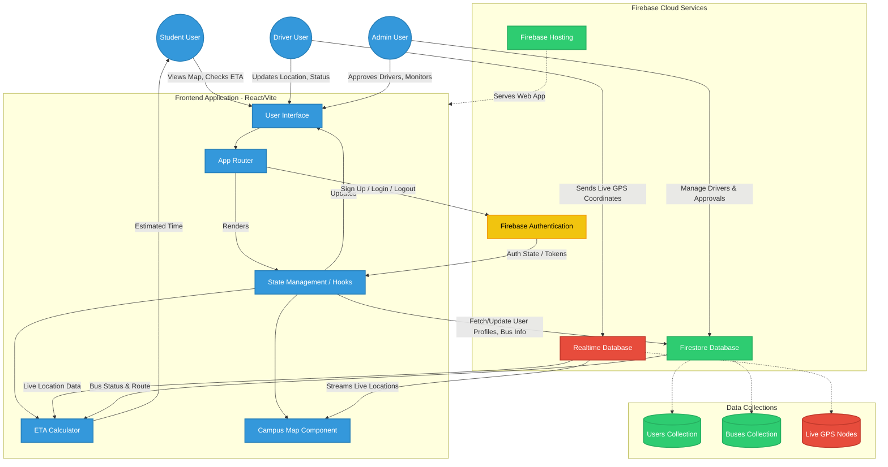

# KIIT SmartBus System Architecture

Here is the system architecture flow of the KIIT SmartBus project, generated using Mermaid. You can use this diagram in your documentation, presentations, or render it using any Mermaid-compatible tool (like GitHub, GitLab, or the Mermaid Live Editor).

## How to use this diagram:
1. View it natively on GitHub/GitLab by opening this markdown file.
2. Copy the code block and paste it into the [Mermaid Live Editor](https://mermaid.live/) to generate a PNG/SVG image.
3. Integrate it into your `README.md` if needed by pasting the code block there.
